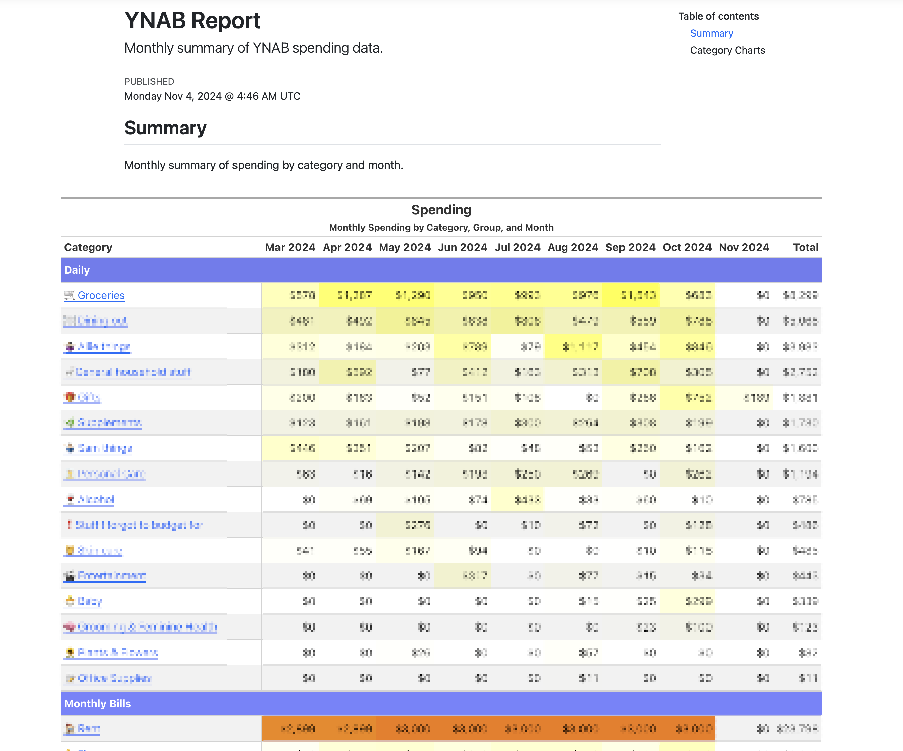
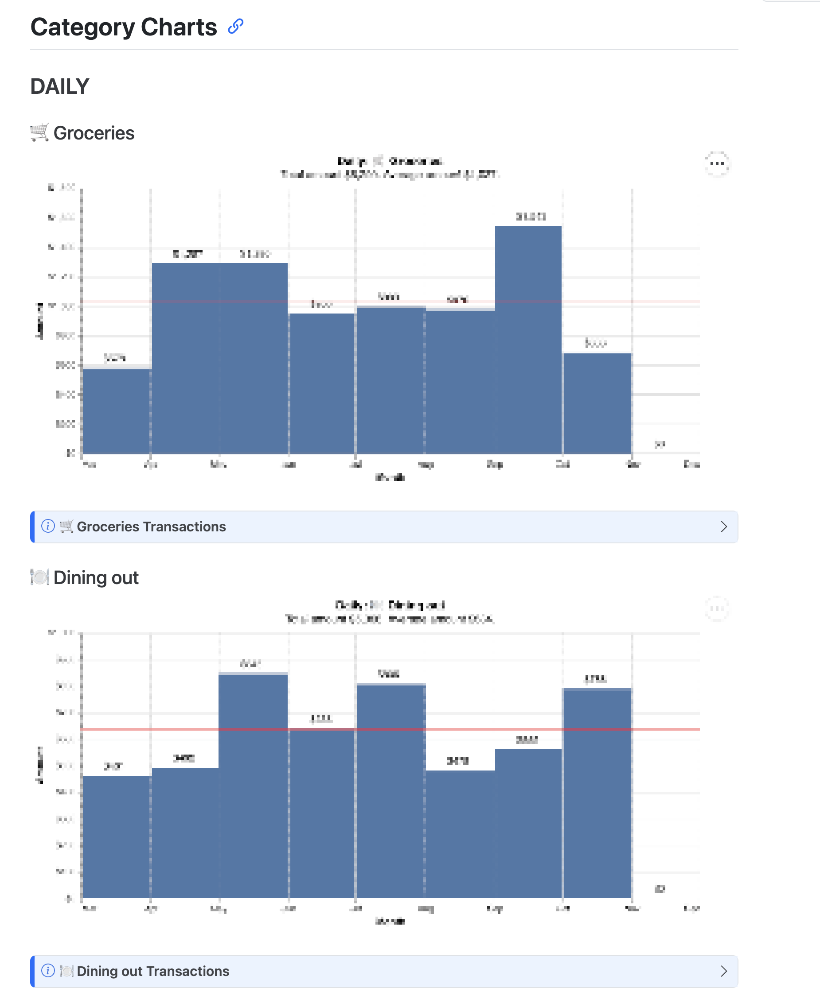

# YNAB Report

A quarto document that summarizes YNAB data.

## Usage

Install dependencies:

```bash
# Install quarto
# Install uv
uv sync
```

Render the quarto document:

```bash
export YNAB_PERSONAL_ACCESS_TOKEN='xxx'
uv run quarto render doc.qmd
open doc.html
```

## Screenshots





